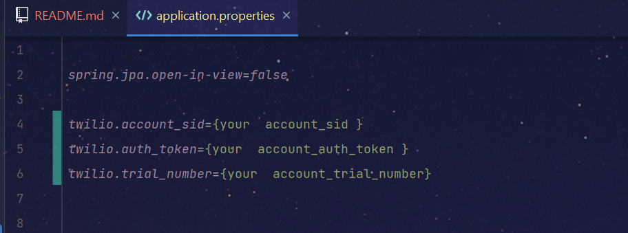

# Twillio SmsSender and Otp validation

## 🔨 Funcionalidades do projecto

- `Funcionalidade 1` `Envio de Sms com um codigo otp(One time password)`: é  necessario informar os seguintes dados : phoneNumber e userName 
  Exemplo :
  ``
  {
  "phoneNumber" : "your number",
  "userName" : "Tiquinho10"
  }
  ``

- `Funcionalidade 2` `Validação  do codigo otp enviado por sms`:  é  necessario informar os seguintes dados : oneTimePassword e username 
  Exemplo :
  ``
  {
  "oneTimePassword" : "7421",
  "userName" : "Tiquinho10"
  }
  ``

## ✔️ Técnicas e tecnologias utilizadas

- ``Java 17``
- ``Spring Boot``
- ``Twillio sdk``
- ``Lombok``
- ``maven``

## 📁 Acesso ao projecto local
- Clone este repositorio ou baixe o arquivo .zip;

## 🛠️ Abrir e rodar o projecto

- Abrir o projecto na sua IDE favorita;
- Rodar o comando `mvn clean install` no terminal;

## Endpoints no Postman

- Coleção  Postman de todas operacoes e endpoints do projecto add link (https://www.getpostman.com/collections/64c2b5731dadd64259d5)

## Requisitos

- Para o envio de sms é  necessario possuir uma conta [Twilio add link](twilio link); 

  Edite o ficheiro application.properties com os seus dados: 

- `account_sid`;
- `auth_token`;
- `trial_number`;

### Colaborador

- [Luiz Tique Junior](https://www.linkedin.com/in/luiz-tique-j%C3%BAnior-154251229/)